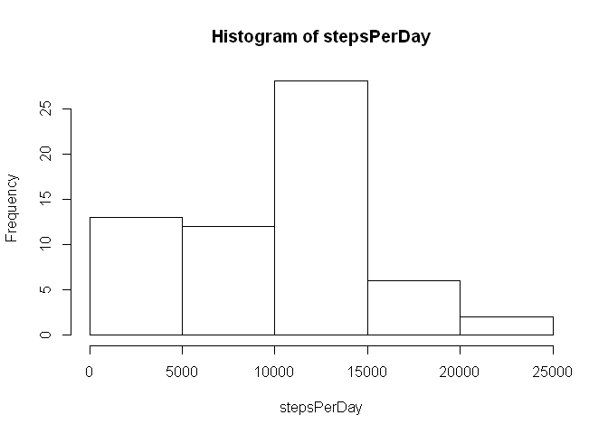
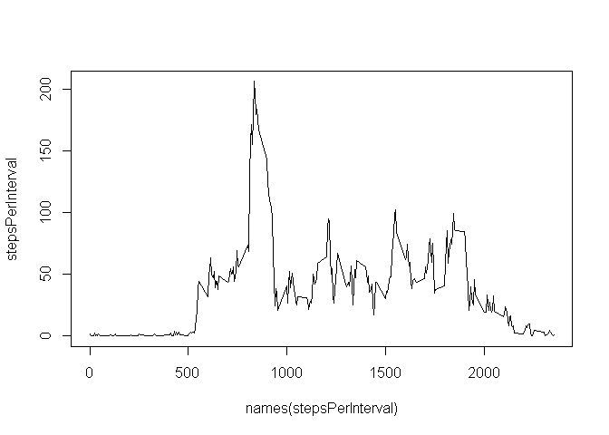
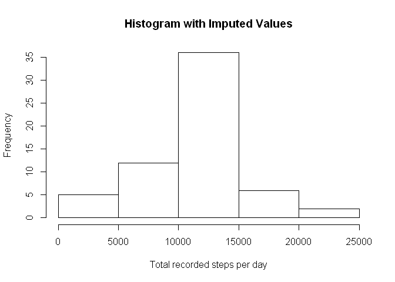
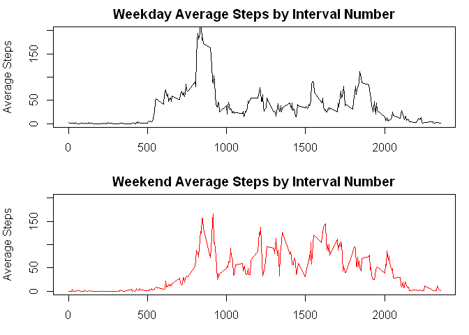

# Reproducible Research: Peer Assessment 1
  
In this assignment, the activity level of individuals whose physical movement was monitored electronically.

Data was collected during 5 minute intervals throughout the day from two months from a single individual. The number of steps during each of these intervals was recorded. The date and an interval identifier are included with each observation.
  
    
## Loading and preprocessing the data
First, the data is loaded into R, and the dates are coerced to a Date class. Also, the day of the week is added to the data frame to classify each day.
  
  

```r
# read in data
activity <- read.csv('activity.csv')
# turn the date column into Date class
activity$date <- as.Date( activity$date, format = '%Y-%m-%d')
# add the weekday to the data.frame
activity$day <- weekdays(activity$date)
```
  
  
## What is mean total number of steps taken per day?
  
  
Here the total number of recorded steps per day is calculated, then these values are examined by a histogram and calculating the mean and median number of steps per day.


```r
stepsPerDay <- tapply(activity$steps, activity$date, sum, na.rm =T)

hist(stepsPerDay)
```

 

```r
mean(stepsPerDay)
```

```
## [1] 9354.23
```

```r
median(stepsPerDay)
```

```
## [1] 10395
```

## What is the average daily activity pattern?
  
Next, the average number of steps per interval is examined to determine what the daily activity pattern looks like, and the most active interval in this set is calculated.
  
  

```r
# calculate the average number of steps per interval
stepsPerInterval <- tapply(activity$steps, activity$interval, 
                           mean, na.rm =T)

plot(names(stepsPerInterval), stepsPerInterval, type = 'l')
```

 

```r
# find the maximum average activity interval
names(stepsPerInterval)[which.max(stepsPerInterval)]
```

```
## [1] "835"
```

## Imputing missing values

There are many missing values in this dataset. First, the number of missing values is calculated. Then a linear model is calculated using the day of the week and the interval as X values and the number of steps as the Y value. Then, a new dataset is produced with the missing values predicted based on this linear model. Lastly, calculate the mean and median with the imputed values included and describe how they are different than those with the na values.


```r
# 1. identify and calculate the number of missing values
idx <- which(is.na(activity$steps))
# Number of missing values...
length(idx)
```

```
## [1] 2304
```

```r
# 2. local regression model model with steps to interval
stepLm <- loess(steps ~ interval, data = activity, span = 0.2)
summary(stepLm)
```

```
## Call:
## loess(formula = steps ~ interval, data = activity, span = 0.2)
## 
## Number of Observations: 15264 
## Equivalent Number of Parameters: 15.17 
## Residual Standard Error: 106.5 
## Trace of smoother matrix: 16.76 
## 
## Control settings:
##   normalize:  TRUE 
##   span	    :  0.2 
##   degree   :  2 
##   family   :  gaussian
##   surface  :  interpolate	  cell = 0.2
```

```r
# create new data frame
activity2 <- activity[,2:4]
# impute missing values using predict() function with this linear model
#    in those rows with na values
activity2$steps <- sapply(1:nrow(activity), function(x) {
                        ifelse(is.na(activity$steps[x]), 
                        predict(stepLm, activity[x,3:4]),
                        activity$steps[x]) }) 

newTotalSteps <- tapply(activity2$steps, activity2$date, sum)

hist(newTotalSteps,
     main = 'Histogram with Imputed Values',
     xlab = 'Total recorded steps per day')
```

 

```r
# mean with imputed values
mean(newTotalSteps)
```

```
## [1] 10750.24
```

```r
# Difference from previous
mean(newTotalSteps) - mean(stepsPerDay)
```

```
## [1] 1396.006
```

```r
# median with imputed values
median(newTotalSteps)
```

```
## [1] 10644.54
```

```r
# Difference from previous median
median(newTotalSteps) - median(stepsPerDay)
```

```
## [1] 249.5424
```

```r
# the impact is that the distribution of the total steps looks a bit more normally distributed; however, the mean and median are relatively similar
```
  
## Are there differences in activity patterns between weekdays and weekends?
  
  
First, an additional column is added classifying each day as a weekday or weekend. Next, plots of the average intervals on weekdays versus weekends are compared.


  

```r
activity2$dayType <- factor(ifelse(activity2$day %in% c("Saturday","Sunday"), 'weekend', 'weekday') ) 

weekdaySteps <- tapply(activity2$steps[activity2$dayType == 'weekday'],
                      activity2$interval[activity2$dayType == 'weekday'], mean)

weekendSteps <- tapply(activity2$steps[activity2$dayType == 'weekend'],
                      activity2$interval[activity2$dayType == 'weekend'], mean)

par(mfrow = c(2,1), mar = c(3,4,2,1))
plot(as.numeric(names(weekdaySteps)), weekdaySteps, type = 'l', col = 'black',
     xlab = 'Interval', ylab = 'Average Steps',
     main = 'Weekday Average Steps by Interval Number',
     ylim = c(0,200))
plot(as.numeric(names(weekendSteps)), weekendSteps, type = 'l', col = 'red',
     xlab = 'Interval', ylab = 'Average Steps',
     main = 'Weekend Average Steps by Interval Number',
     ylim = c(0,200))
```

 

Based on this data, it looks like this individual started taking steps earlier in the day during weekdays. There was a little bit more activity during the middle of the day during the weekends. Also, there was a little bit more activity at later intervals on the weekends. 
